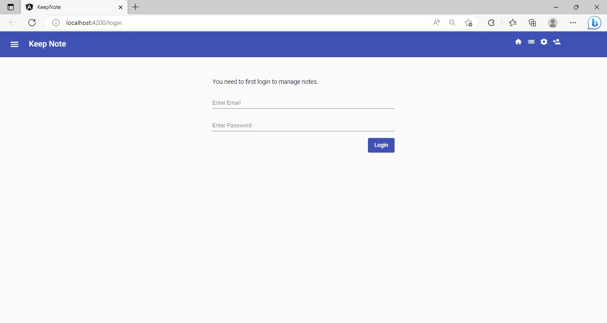
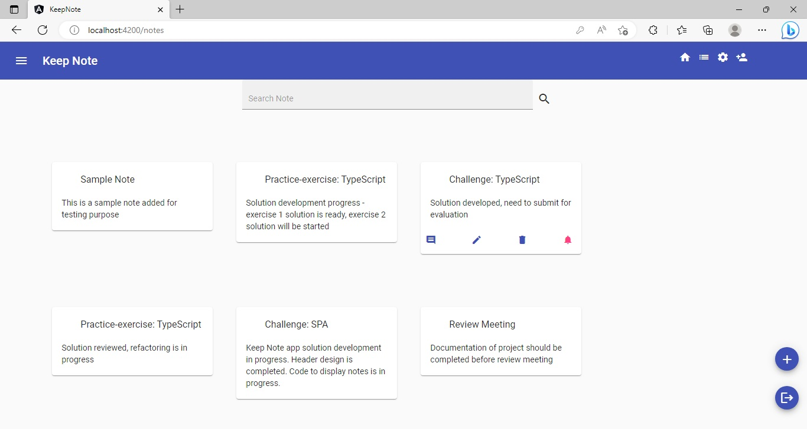
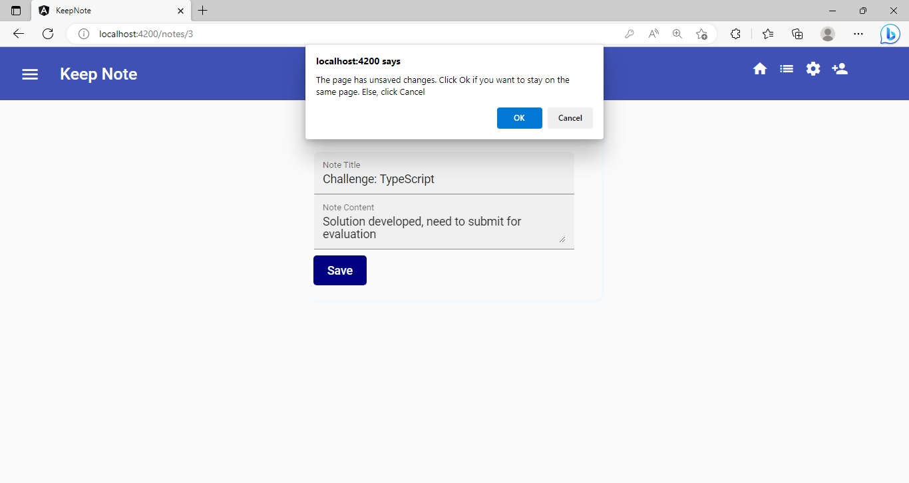

## Challenge - Guard Routes in the `Keep-Note` Application

### Points to Remember
- Only the authenticated users should be allowed to view, add, edit or delete notes.
    - The unauthenticated users should be redirected to the login view for authentication, if they try to navigate to the views related to the notes data.
- The code should be well indented for better readability.
- Appropriate comments should be added to increase readability.​
​
### Instructions for Challenge

- Fork the boilerplate into your own workspace. ​
- Clone the boilerplate into your local system. ​
- Open command terminal and set the path to the folder containing the cloned boilerplate code.​
- Run the command `npm install` to install the dependencies.
- Copy the files from the `app` folder of the `Keep-Note` solution developed for the challenge of the previous sprint - `Sprint 4: Implement Navigation using Angular Routing`.
    - Paste these files in the `app` folder of the boilerplate code.

Notes:
1. The solution of this challenge will undergo an automated evaluation on the `CodeReview` platform. (Local testing is recommended prior to the testing on the `CodeReview` platform)
2. The test cases are available in the boilerplate.

### Context

As you are aware, `Keep-Note` is a web application that allows users to maintain notes. It is developed as a single-page application using multiple components. 

Note: The stages through which the development process will be carried out are shown below:
- Stage 1: Create basic `Keep-Note` application to add and view notes.
- Stage 2: Implement unit testing for the `Keep-Note` application.
- Stage 3: Create `Keep-Note` application with multiple interacting components to add, view and search notes.
- Stage 4: Implement persistence in the `Keep-Note` application.
- Stage 5: Style the `Keep-Note` application using Material design.
- Stage 6: Create simple form with validation in the `Keep-Note` application.
- Stage 7: Create complex form with validation in the `Keep-Note` application.
- Stage 8: Enable navigation in the `Keep-Note` application.
- **Stage 9: Secure routes in the `Keep-Note` application.**

- In this sprint, we are at Stage 9.​
- In this stage, the routes of the `Keep-Note` application need to be guarded using `CanActivate` and `CanDeactivate` guards.

### Problem Statement

In this final stage of development of the `Keep-Note` application, the user should first log in and get the credentials validated. Upon successful validation, the user should be allowed to access views that permit interactions with the notes data.

The application should also seek confirmation from the user before leaving the edit note view with unsaved changes.

Note: The activities to develop the above solution are given​ below:

#### Activity 1: Guard Routes With Restricted Access

- In the `Keep-Note` application, add a service with the name `AuthService`. The details about this service are given below:
    - The service class should be in the `services` folder along with the other service classes.
    - Inside the `AuthService`:
        - Define a method `login()` that validates the users' login credentials (email and password) and sets the users' login status accordingly. 
            - For this challenge, you can use dummy values for login credentials.
        - Define a method `logout()` that allows users to logout.
        - Define a method `isLoggedIn()` that checks for user's logged in status.
- Add a Login Component that handles the following responsibilities:
    - The login view should allow the users to enter their email and password as login credentials.
    - It should have a button to submit and get the login credentials validated by the login() method of AuthService.
- Define the route to navigate to the Login component
- Enable programmatic navigation to the Login component by defining the method navigateToLoginView() in the RouterService.
- Define `CanActivate` route guard with the name `AuthGuard`. The details about the guard are given below:
    - The guard should return value `true` for logged in users otherwise redirect users to the `login` view and return value `false`.
        - Call the appropriate method from the `AuthService` to check the logged in status of the user.
        - Call the appropriate method from the `RouterService` to enable navigation to the login view
- Apply guard to routes with restricted access based on the details given below:
    - The access to all the views handling notes data should be restricted.
    - When the application gets launched, the `login` view should be the default view.
    - Post successful login, the application should navigate the users to the `notes` view.
    - The `notes` view should have provision to allow the users to logout.
    - Once logged out, the users should again be navigated to the `login` view.
    - Without logging in, users should not be provided access to the `notes` view.

Note: The component class name, service class name and the method names mentioned above are used in testing, so you must use the same names while coding. ​

##### Expected Output – Login View

##### Expected Output – Notes View (After Successful Login)

#### Activity 2: Prevent Losing Unsaved Changes Using Guard
-  Add `CanDeactivate` route guard with the name `CanDeactivate`. The details about the guard are given below:
    - The guard should call the method `canDeactivate()` of the target component and return the value returned by that method.
- Refactor the component that edits note to implement a confirmation workflow for unsaved edit changes. The details to refactor are given below:
    - Add `canDeactivate()` method that seeks confirmation from the user if changes are not saved and accordingly returns a `boolean` value.

Note: The guard name and the method name mentioned above are used in testing, so you must use the same names while coding. 

##### Expected Output – Edit View (Leaving without Saving)

### Test the Solution Locally​

Test the solution first locally and then on the `CodeReview` platform. Steps to test the code locally are:
- From the command line terminal, set the path to the folder containing cloned boilerplate code.
- Run the command `ng test` or `npm run test` to test the solution locally and ensure all the test cases pass.
- Refactor the solution code if the test cases are failing and do a re-run.​
- Finally, push the solution to git for automated testing on the CodeReview platform.

### Test the Solution on the `CodeReview` Platform

Steps to test the code on the `CodeReview` platform are:
- Open the submission page at [https://codereview.stackroute.niit.com/#/submission](https://codereview.stackroute.niit.com/#/submission).
- Submit the solution.
- For the failed test cases, refactor the code locally and submit it for re-evaluation.

